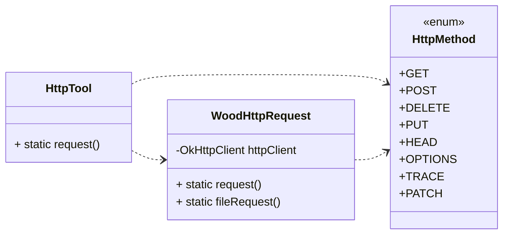

```mermaid
classDiagram
	direction LR
	class HttpTool{
		+ static request()
	}
	class HttpMethod {
		<<enum>>
		+GET
		+POST
		+DELETE
		+PUT
		+HEAD
		+OPTIONS
		+TRACE
		+PATCH
	}
	class WoodHttpRequest{
		-OkHttpClient httpClient
		+ static request()
		+ static fileRequest()
	}
	
	HttpTool ..> WoodHttpRequest
	HttpTool ..> HttpMethod
	WoodHttpRequest ..> HttpMethod
```